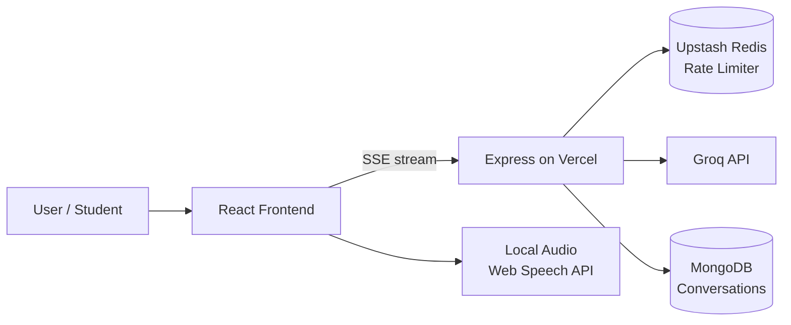

# Mulinguae AI Chatbot Architecture

A decentralized, serverless AI chatbot for the Mulinguae platform that delivers
secure, cost-effective conversational capabilities with **zero hosting fees**
and high scalability.

## Overview

The global free AI chatbot combines:
- **Node.js + Express** backend
- **Vercel** serverless hosting
- **Groq** LLM inference (free tier)
- **Upstash Redis** for distributed IP rate limiting
- **Two-way local audio processing** (Web Speech API / MediaRecorder) for future voice features

This design keeps hosting costs at $0 while providing a responsive, voice-capable
assistant that can answer questions about anything related to the website.

---

## Architecture Diagram



- **Frontend** (React + Vite) renders the chat UI and streams responses via SSE.
- **Backend** (Express) proxies messages to Groq, applies rate limits, persists conversations.
- **Groq** generates the AI responses (free tier).
- **Upstash Redis** provides distributed rate limiting that works across serverless instances.
- **Local audio** (Web Speech API) handles speech-to-text and text-to-speech entirely in the browser — no server audio cost.

---

## Directory Structure

### Frontend (`mulingua-project`)

```
src/
  apis/
    chatbot-api.js              # SSE streaming API client
  components/
    Chatbot/
      Chatbot.jsx               # Main floating chat widget
      Chatbot.scss              # Luxury modern dark theme styles
      components/
        ChatHeader.jsx
        ChatMessage.jsx
        ChatInput.jsx
        MessageList.jsx
        PredefinedSuggestions.jsx  # Quick-question buttons
      context/
        ChatbotContext.jsx
      hooks/
        useChatbot.js
        useVoice.js
      audio/
        audioProcessor.js       # Recording, STT, TTS utilities
      knowledge/
        websiteKnowledge.js     # Website knowledge base + suggestions
      utils/
        chatbotUtils.js
  components/
    Layout.jsx                  # Mounts <Chatbot /> globally
```

### Backend (`mulingua-backend`)

```
services/
  groqService.js                # Groq API integration
  knowledgeBase.js              # Website knowledge for system prompt
  conversationService.js        # MongoDB conversation persistence
controllers/
  chatbot/
    chatbotController.js        # Chat handlers (SSE streaming)
middleware/
  chatbot/
    rateLimitMiddleware.js      # Upstash Redis + in-memory rate limits
routes/
  chatbot/
    chatbotRoutes.js            # /api/chatbot endpoints
  index.js                      # mounts chatbotRoutes at /api/chatbot
api/
  chatbot.js                    # Optional standalone Vercel function
```

---

## How the AI knows about the website

The assistant is given a **structured knowledge base** (not just a one-line prompt).
The full platform information — every page, feature, user role, and workflow —
is injected into the **system prompt** before the user's messages.

- **Frontend** knowledge: `src/components/Chatbot/knowledge/websiteKnowledge.js`
- **Backend** knowledge (system prompt): `services/knowledgeBase.js`

The backend's `buildKnowledgeSystemPrompt(domain)` generates a detailed system
prompt that includes:
- Platform overview (name, mission, description)
- Every main page and its purpose / URL
- User roles and permissions
- Technical features
- How to help users

This lets the AI answer questions about **any page or feature** on the website,
such as "How do I book a lesson?", "What is Education for All?", or
"How do I become a teacher?".

To add a new page/feature, just add it to the knowledge base and the AI will
immediately know about it.

---

## Predefined Suggestions ("Quick Questions")

When a chat opens (before any conversation), the user sees a **"Popular Topics"**
panel with category tabs (Getting Started, Teachers, Courses, Booking, Technical,
Community) and clickable questions. Clicking one sends it as a normal message.

Source: `websiteKnowledge.js` → `commonQuestions` and `getAllSuggestionCategories()`.

To change the suggestions, edit the `commonQuestions` object — the UI updates
automatically.

---

## Streaming (SSE)

The backend streams Groq's response to the frontend using Server-Sent Events:

- `GET`/`POST` `/api/chatbot/chat` → streams `data: {content}` chunks
- Frontend `streamChatMessage()` consumes the stream and appends text progressively

---

## Rate Limiting (Upstash Redis)

`middleware/chatbot/rateLimitMiddleware.js` implements a **sliding window**
rate limiter using Upstash Redis sorted sets:

- **20 messages / minute / IP**
- **100 messages / hour / IP**

It sets `X-RateLimit-*` headers and returns `429 Too Many Requests` with a
`retryAfter` when exceeded. Works across all Vercel serverless instances.
A `createInMemoryRateLimiter` fallback is also provided for local dev.

> Requires `UPSTASH_REDIS_REST_URL` and `UPSTASH_REDIS_REST_TOKEN` env vars.

---

## Voice (Future-Enabled)

`audio/audioProcessor.js` and `hooks/useVoice.js` provide a ready foundation for
**two-way local audio**:
- `AudioRecorder` — microphone → WebM blob (MediaRecorder)
- `createSpeechRecognizer` — Speech-to-Text (Web Speech API)
- `speakText` / `getAvailableVoices` — Text-to-Speech

Because processing happens **in the browser**, there's no audio hosting/server cost.
This is intended for future features like students talking to the AI about
teacher profiles (not yet implemented).

---

## Environment Variables

See `.env.example` in both repos. Key chatbot vars:

| Variable | Purpose |
|----------|---------|
| `GROQ_API_KEY` | Groq LLM API key |
| `UPSTASH_REDIS_REST_URL` | Upstash Redis URL for rate limiting |
| `UPSTASH_REDIS_REST_TOKEN` | Upstash Redis token |
| `VITE_BACKEND_URL` | Backend base URL (frontend) |

---

## Deployment (Vercel)

1. Set the env vars above in the Vercel project.
2. Deploy the backend; all `/api/*` routes (including `/api/chatbot`) are served
   by `app.js` via `vercel.json`.
3. Deploy the frontend; the widget is mounted in `Layout.jsx` and points at
   `VITE_BACKEND_URL`.

No paid hosting required — Groq's free tier + Vercel's free tier + Upstash's
free tier keep the running cost at **$0**.

---

## Future Roadmap

- [ ] Persist full conversation history retrieval by authenticated user
- [ ] Domain-specific knowledge injection (e.g., teacher profiles with live data)
- [ ] Voice input/output for chat (speech-to-text + text-to-speech)
- [ ] Voice Q&A about teacher profiles
- [ ] Admin-controlled knowledge base / FAQs
